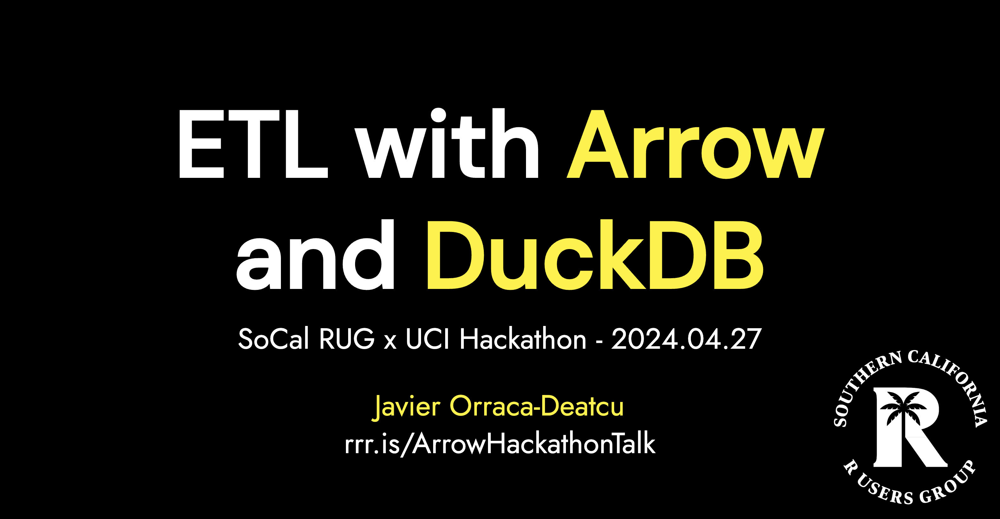

# UC Irvine 2024 Hackathon Workshop: Arrow & DuckDB

This repo contains materials from my [_ETL Intro with Arrow & DuckDB_](javorraca.github.io/UCI-2024-Hackathon-Workshop-Arrow-DuckDB/) presentation at SoCal RUG + UCI's 2024 hackathon hosted by UCI's _Paul Merage School of Business_ and the _Merage Analytics Club_.

